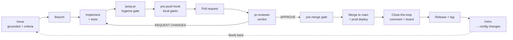

# Team and process — how a one-human, many-agent team ships software

How work actually moves through this repository: who does it, what gates it passes,
and why the process looks the way it does. Every number below was measured in this
repository, and the section that explains a rule names the incident that produced it.

**This article is descriptive, not aspirational.** Where a process failed, it says so
and gives the count. A process document that only records intentions cannot be
checked, and an unchecked process is indistinguishable from no process.

## Scope and canonical ownership

| Surface | Canonical for |
|---|---|
| **This article** | Team composition, the work loop, the gate model, the retrospective cycle, and the rationale behind each. |
| **`CLAUDE.md`** | The operative rules themselves — the normative text agents load on every session. |
| **`docs/wiki/production-deployment.md`** | Host lifecycle, the shared edge, TLS, incident response. |
| **`docs/retrospectives/`** | The per-release record and the trend table this article summarizes. |
| **`.claude/skills/`** | Executable method: `issue-workflow`, `release-retro`, `lessons-learned`, and the rest. |

If this article and `CLAUDE.md` disagree, **`CLAUDE.md` wins** and this page is stale —
fix it in the same PR.

---

## Who is on the team

The unusual thing about this project is its team shape: **one human owner and a fleet
of AI agents**, with no other human contributors. That constraint drives nearly every
process decision on this page.

| Member | Kind | Owns |
|---|---|---|
| **Owner / maintainer** | human | Direction, priorities, releases, anything irreversible or outward-facing, and every decision the agents are not authorized to make. |
| **Main loop** | Claude Code session | Most implementation, orchestration, and the running conversation. Delegates to subagents. |
| `backend-dev` | subagent | Reproduce → fix → verify Python/FastAPI diagnoses; delivers via PR. |
| `frontend-dev` | subagent | The same for the Angular/TypeScript workspace. |
| `pr-reviewer` | subagent | The independent merge verdict on **every** PR. |
| `release-manager` | subagent | Assemble and ship a release end to end. |
| `devops-pipeline` | subagent | Babysit the prod pipeline after a merge; classify failures and brief the dev agents. |
| `security-triage` | subagent | CodeQL / Dependabot / Snyk / secret-scanning triage every release. |
| `issue-author` | subagent | Turn a rough idea into a grounded, criteria-complete issue. |
| `ai-integration` | subagent | The improvement loop: turn measured agent behaviour into edits to the charters, skills and hooks. |

Around them sits the enforcement layer, measured 2026-09-14: **8 slash commands, 7
skills, 4 `PreToolUse` hooks** (plus `hook-parse-lib.sh`, the one command-parsing model
all four share) **each with a self-test, and 9 scripts in `scripts/`, 7 of which are
repo-contract checks carrying their own `*.test.sh`**. The hooks and lints are the part
that matters most, for the reason in [§ Why the rules are
executable](#why-the-rules-are-executable).

### The separation-of-duties problem

Human teams get independent review for free: a different person reviews the code. This
team cannot. **Every agent posts to GitHub under the same identity** — the owner's.
That has three consequences the process has to work around:

1. `gh pr review --approve` is blocked on your own PR, so verdicts are posted as
   comments and the merge gate reads comments, not GitHub's approval state.
2. An author's fix report and a reviewer's verdict are **indistinguishable by author**.
   They are separated only by *position*: a verdict states `APPROVE` or
   `REQUEST CHANGES` on the body's **first non-empty line**, and fix reports must not
   open with a marker. This is not style — on PR #291 a loose matcher counted an
   author's fix report as the newest verdict and would have permitted a merge against
   a standing REQUEST CHANGES.
3. The reviewer must be a **separate agent invocation with no memory of writing the
   code**. An author reviewing their own work finds what they were already thinking
   about.

---

## The work loop

Six properties of this loop are non-negotiable, and each exists because its absence
cost something measurable.

**Issues are the notebook.** Every idea, bug, deferred fix and research decision is a
GitHub issue — never only in chat or in an agent's memory. At the `v1.14.1` tag the
repository held **162 issues across 11 thematic milestones** and **173 merged PRs** (the
open count moves daily and is deliberately not quoted here). Milestones are reusable
*themes*, not versions; a per-version milestone scheme would have produced fifteen dead
buckets by now.

**No orphan issues.** Every issue carries a milestone, a priority label
(`P0-critical` … `P3-low`) and at least one area label. `/issue-triage` sweeps for
violations.

**Work is delivered by PR, never pushed to `main`.** The merge *is* the production
deploy trigger — push to `main` runs `deploy.yml`, which builds, publishes and rolls
the host. There is no separate "deploy" action to forget.

**Every PR gets an independent verdict.** No carve-outs. See [§ The review
gate](#the-review-gate).

**Close-the-loop is a comment, not an auto-close.** A `Closes #NN` leaves no record —
the issue reads as "just closed" to anyone later. The rule is a comment naming the PR,
the merge SHA, the pipeline result, and **each acceptance criterion with how it was
verified**. If a criterion is unmet, say so and leave the issue open.

**A release ends with a retrospective**, not with the tag. See [§ The improvement
loop](#the-improvement-loop-retrospectives).

---

## The gate model

Four gates sit between an idea and production. They are deliberately redundant,
because each catches a class the others structurally cannot.

| Gate | When | Enforced by | Catches |
|---|---|---|---|
| **`/prep-pr`** | before opening the PR | command (advisory) | Stale base, duplicated CHANGELOG entries, stale assertions, unmeasured claims. |
| **pre-push** | every `git push` | `pre-push-tests.sh` (PreToolUse hook) | Docs, backend pytest + ruff + mypy, the three frontend Vitest projects, every hook and lint self-test. |
| **`pr-reviewer`** | before merge | rule 13, enforced at the next gate | Correctness, security, thin tests, blast radius, doc drift. |
| **pre-merge** | every `gh pr merge` | `pre-merge-gate.sh` (PreToolUse hook) | Missing verdict, a REQUEST CHANGES standing, an APPROVE older than the head, a `CONFLICTING` base, `Closes #NN` against unticked criteria. |

Plus a standing guard pair that is not about correctness at all:
`guard-destructive.sh` blocks irreversible local and infrastructure destruction
(rule 9, written after a subagent deleted a Docker volume on its own initiative), and
`guard-stack-resources.sh` enforces a free-disk floor and **one** Docker compose
project at a time — three parallel stacks once filled the disk, crashed the daemon and
cost about two hours.

### Why the rules are executable

The single most important design decision in this repository: **a rule that lives only
in prose drifts, and nobody notices.**

The evidence is direct. The `CLAUDE.md` AI-config map — the table describing which
agents, commands, skills and hooks exist — had no guard and silently went stale. The
fix was not a review checklist item but `scripts/check_aiconfig_map.sh`, which fails
the build when the map stops describing the filesystem. The same pattern repeats:

| Rule that drifted | Now enforced by |
|---|---|
| "The AI-config map must be accurate" | `check_aiconfig_map.sh` (pre-push + CI + `verify_all.sh`) |
| "Every documented setting must reach the container" | `check_compose_env.sh` — the same bug shipped three times first |
| "Exactly one Alembic head" | `check_migration_heads.sh`, measured against `origin/main` — two PRs were each single-head alone and forked the chain only in the merged result, which would have stopped the prod backend booting |
| "No real PII or retired branding in a public repo" | `check_no_pii.sh`, whose exclude list **fails closed** |
| "Don't merge without a review" | `pre-merge-gate.sh` |

**And the counter-example, which is the most useful row in the table:** *"one `[Unreleased]`
CHANGELOG section"* is **not** on it. The repository owns a tool —
`scripts/dedup_changelog_unreleased.py`, which knows that a heading-only check passes while
*entries* are doubled — but it is a **fixer invoked by a command someone must remember to run**,
not a gate. Its self-test runs in the pre-push gate and tests *the script*, never the
repository's own `CHANGELOG.md`. In the v1.14.1 cycle that rule was broken at blocker level on
**7 of 16 reviewed PRs**, more than any other class, *after* the tool shipped. Knowledge was
never the gap; enforcement level was. Promoting it to a lint is filed as issue **#391**, and the
next retrospective checks whether that happened.

**The corollary is uncomfortable and worth stating plainly:** a check nobody has proven
can fail is not a check. Four "passing" cases in one test file turned out to be
fake-greens — an indentation-protected fixture, a masking bug, a harness that never
asserted the script ran, and a counter killed by a subshell — and an entire lint
category in the drift checker **could not fail at all**. Every one was found by
*mutation*, never by reading. So each hook and lint ships a `*.test.sh` beside it, the
most important ones carry an explicit `--mutations` contract, and all of them run
inside the pre-push gate.

### Scoping the gates to the change

Running every gate on every push is correct and slow. The owner's verdict, 2026-09-13:

> The push time is absolutely inappropriate … only changed code must be validated.
> 10-15 minutes, I can understand for the release branches, but simple 2 files commit
> for example every time takes 15 minutes.

That is issue **#377** (P0, v1.14.2): path-scoped gates so a docs-only push runs in
under two minutes and a backend-only push runs backend legs only — while pushes to
`main` and release branches keep the **full** gate, because that is where a fork or a
collision actually costs a red deploy. Cheap gates get run; expensive gates get
bypassed, and a bypassed gate protects nothing.

---

## The review gate

**Rule 13: every PR requires a posted `pr-reviewer` APPROVE before merge. No
exceptions** — not hotfixes, not dependency bumps, not one-line docs changes, not
changes the owner directed in real time. Green CI, a passing local suite and validation
by the implementing dev agent are *necessary but not sufficient*; none of them is an
independent review. Urgent work gets an **expedited** review, never a skipped one.

Two operating rules were added after measuring their absence:

**Rebase before you request a review.** Owner directive 2026-09-13: *"Never starting
review before rebase and pulling the code from main branch, this unacceptable spending
resources."* A review of a stale branch is wasted twice — it burns a full analysis to
produce "rebase first", and it clears code against a base that will never merge. In the
v1.14.1 cycle: **five stale-base blockers across five PRs, two of which consumed a
review round and nothing else** — roughly 140,000 tokens spent to say "rebase". Now a
mechanical deny at the merge gate.

**One PR per review run.** Owner directive: *"Never use the review agent for multiple
PRs — one for one PR."* Batching was tried and measured: four batched runs cost
425,000 tokens, the worst single run 162,690 tokens in 25.5 minutes, and verdicts
arrived late and together so fixes for the first PR could not start until the last was
analysed.

### What review actually catches

The case for spending 81% of a cycle's agent budget on review is empirical. In v1.14.1
the reviews caught, among other things:

- a **live open redirect** that survived three separate fixes and three green CI boards;
- a **new security bypass introduced by an optimisation** to the destructive-command
  guard — the author assumed a helper was identity on quote-free input; it also
  de-escaped `\X` and blanked `#`. The review measured **seven** guarded commands flipping
  from deny to allow — one of them the exact command from the incident the guard was written
  for — and 15 of 23 quote-free inputs producing a different *decision*;
- a drift checker whose entire `lint` category could not fail;
- a CHANGELOG tool that **silently deleted** unrecognised sections — 66 commits in this
  repository's history carry one;
- a branch commit that had deleted a released `## [1.14.0]` heading.

Every one of those was green on CI. **In v1.14.1, no review round found nothing** — all 41
verdicts raised at least one finding. That is measured for v1.14.1 only; the earlier releases
in the series were not counted this way, so read it as one release's result, not a law.

### Findings are fixed in the PR

Owner directive 2026-09-06:

> if the behavior was not confirmed by the reviewer during the review — do not open a
> new issue, resolve it immediately during the work on the PR. I do not need the amount
> of issues growing, I need clear progress.

A finding is deferred to an issue **only** when it is genuinely out of the PR's scope —
a different subsystem, or work already scheduled for a later release — and then the PR
says so explicitly. Backlog growth is not progress.

### An approval covers the head it reviewed

The subtlest failure this team has measured. Replaying the real threads at merge time
for v1.14.0, **four of ten reviewed merges carried commits no approval had seen** — one
merged four commits after its only verdict (including the fixes to the reviewer's own
findings *and* a behaviour change), one merged two seconds before its delta-confirm was
posted, one merged a `main` merge, and the **release PR** merged a CHANGELOG commit, so
that release's tag sits on an uncovered commit. One PR merged with no verdict at all.

A merge of `main` is not benign — that is exactly how the Alembic head fork appeared.
The remedy is a fresh `## ✅ APPROVE — round N (delta-confirm at <sha>)`, never a
bypass. `pre-merge-gate.sh` now enforces it.

---

## Measuring the work

Two instruments, and a standing rule about both.

**Effort telemetry, captured live.** Per-agent token and wall-clock cost is recorded
*during* the cycle, because it is **not recoverable afterwards** — when a release
manager was asked to reconstruct it, it correctly refused. The v1.14.1 baseline:
**26 agent runs, 2,600,168 subagent tokens, 361.8 agent-minutes (6.0h), 23 of 26 runs
(88%) review — 81% of spend.** The per-run table is committed as an appendix to
`docs/retrospectives/v1.14.1.md`, because a number held only in a machine-local scratch
file is not something a reader can check. (Subagent totals only; main-loop tokens are not
included, so the true cycle cost is higher — state the caveat rather than implying
precision the measurement lacks.)

**GitHub Project 3** carries per-item `Tokens (k)`, `Time of processing (min)`,
`Review rounds`, `Agent` and `Model`, updated **immediately on every merge**, never
batched. One caveat is load-bearing: the `Review rounds` field has disagreed with the
thread when filled, so **the thread is the instrument** — it is executable and
re-derivable by anyone — and the field is not published from.

### Report what you measured, not what you expect

Rule 7, and the most frequently violated rule in the repository's history. Claims that
were confidently wrong until someone ran the thing: *"the release deploys correctly"*
(the images were private), *"a regression fails the suite"* (it passed both ways),
*"15 cases"* (there were 18), *"dependency-free"* (it needed npm), *"grep returns
nothing"* (41 hits). **All ten merged PRs in one release carried at least one claim that
did not reproduce, nine at blocker level.**

The discipline that fixes it is mechanical, and it is step 7 of `/prep-pr`: list every
number in the PR body, the commit message and the CHANGELOG entry, then **run the thing
that produces each one, at this head**, and correct it. Quote each number with the
conditions that produced it — a baseline counted on a dirty worktree, a mutation count
from a partial run, and a matrix measured against a pre-final version of the suite it
described each cost a review finding.

---

## The improvement loop: retrospectives

A release is finished when what it taught is written down, not when the tag is pushed.
`/retro` runs `ai-integration` over the window's issues, PRs, review threads and
telemetry, answering five fixed questions — acceptance criteria, issue quality, code
quality by defect *class*, review actions, cost — and turning findings into committed
changes to the agents, skills, hooks and rules.

Three properties make it more than ceremony:

**Enforcement order.** For each finding, name the single cheapest change that prevents
recurrence, preferring **hook > skill > charter > `CLAUDE.md` > command**. A hook
cannot be forgotten; a paragraph can. Prune as readily as you add.

**A retrospective that changes no configuration must say why, in writing.**

**Every retrospective records a prediction** that the next one checks. A prediction
nobody checks is decoration.

### The trend table

Kept in `docs/retrospectives/README.md`, with documented counting conventions so the
series stays comparable:

| Release | PRs | Mean rounds | Approved r1 | Rework share |
|---|---|---|---|---|
| v1.12.0 | 10 | 2.4 | 20% | 58% |
| v1.13.0 | 16 | 3.13 | 0% | 68% |
| v1.14.0 | 11 | 1.82 | 27% | 45% |
| v1.14.1 | 17 | 2.41 | 29% | 59% |

The counting conventions are not pedantry — they were written because four hand counts
of the same window (30, 32, 34, 29) were reported and **none reproduced**. Two lessons
generalize beyond this repository:

- **Get the corpus right before blaming the matcher.** Both wrong published counts came
  from selecting the wrong set of PRs, not from a bad regex.
- **Read what your matcher rejected.** The widened sweep once surfaced two
  `## ⛔ REJECTED` verdicts in a since-retired heading format; they hid two real rounds
  and made a release look like it had one round-1 approval when the true figure was
  **0 of 16**.

**Predictions have failed, and the failures are recorded.** v1.12.0 predicted mean
rounds below 2.0 and at least 40% round-1 approvals; v1.13.0 measured **3.13** and
**0%**. The diagnosis was not churn — the release's *material* changed to
credential-, billing- and container-configuration-shaped work — and the honest
counter-evidence was recorded alongside it: zero review rounds found nothing.

### Targets are stated as numbers

v1.14.2's KPIs (issue #386) are typical of how direction becomes measurable. The owner
asked for *"less review rounds, less costs, faster push, more dynamic"*; each became a
target against a measured v1.14.1 baseline:

| Dimension | v1.14.1 baseline | v1.14.2 target |
|---|---|---|
| Mean review rounds / PR | **2.41** (41 verdicts, 17 PRs) | ≤ 1.6 |
| Round-1 approvals | **29% (5 of 17)** | ≥ 50% |
| Subagent tokens / merged PR | **~153k** (2.60M ÷ 17) | ≤ 120k |
| Review share of spend | **81%** | ≤ 65% |
| Docs-only push | full gate (~15 min) | ≤ 2 min |
| PR opened → first verdict | often hours | ≤ 30 min |
| Fake-greens reaching review | **5** | 0 |

**The first three baseline cells are corrections, and the correction is itself the lesson.**
Issue #386 filed them as *2.5 (33 rounds, 13 PRs)*, *15% (2 of 13)* and *~191k* — counted
mid-assembly over a partial corpus that omitted four merged PRs, including the release PR. The
canonical corpus is 17 PRs / 41 verdicts. Two of the targets were calibrated against numbers
that were wrong in the *flattering* direction on rounds and the *harsh* direction on cost, so
the baseline moved without the targets needing to. **A target measured against a wrong baseline
is worse than no target** — it produces confident reporting of a change that did not happen.
The canonical figures are in `docs/retrospectives/v1.14.1.md`, which is where this table is
reconciled from; #386 carries the correction as a comment.

---

## Standing constraints

Rules that override convenience, with the reason each exists.

**Never real credentials in tests or CI.** No test, fixture, seed or CI stack may
authenticate to a paid, metered or rate-limited service with a real credential — mock
at the test boundary, or route to a free local fallback with an empty/dummy credential.
A real key wired into an automated test fires on *every* pipeline run: silent,
unbounded, recurring cost, plus needless credential exposure in CI logs.

**No irreversible local or infra destruction** without explicit authorization naming the
resource. No `docker volume rm`, no `down -v`, no `system prune`, no dropping a
non-`test_*` database, no recursive `rm` of a data directory. **A backup is not a
substitute for authorization.** Prefer the non-destructive path — bump the image to
match the volume schema, migrate, or leave it alone.

**No secrets and no internal service identifiers in public artifacts.** The repository
is public. That includes AI-tooling session identifiers: never write a session trailer
or URL into a commit message, PR, issue or changelog. Co-authorship attribution is
fine; the session link is not.

**Validated on every applicable layer.** Backend unit, frontend unit ×3 projects, E2E in
a real browser for any user-facing surface, the WireMock integration tier for any
composed API/AI path. "The units are green" is not validation — one release shipped
three screens at 100% unit coverage that had never rendered in a browser. CI runs E2E
and the integration tier on **push only**, so a PR cannot carry CI evidence for them:
run them locally and state the measured result. If a layer does not apply, say *which*
and *why*.

**Commit durable lessons; don't hoard them.** A hard-won lesson goes into the in-repo
`.claude/skills/lessons-learned/` as part of the change — not only into machine-local
memory that fresh contexts and future readers cannot see. Uncommitted knowledge does
not compound.

---

## What this costs, honestly

This process is heavy for a portfolio site, and pretending otherwise would be the same
failure mode the process exists to prevent. The trade is deliberate:

- Review consumes **81% of the agent budget**. The justification is the defect list in
  [§ What review actually catches](#what-review-actually-catches) — a live open
  redirect and a self-inflicted security bypass, both green on CI.
- The mean PR takes **2.41 review rounds**, so most work is seen at least twice.
- Two PRs in one cycle consumed **46% of all review spend** (37% of total) — cost is
  dominated by outliers, not by the median.

The counterweights are the KPIs above, the scoped-gate work in #377, and the standing
rule that agent parallelism stays at **solo + one agent** outside an explicitly
authorized release push. Quota is a real constraint, and the owner sets it per cycle.

---

## For a fork or a new contributor

Beaconfolio is built to be forked as a portfolio template, and this process comes with
it. The minimum viable subset, in order of value:

1. **`CLAUDE.md`** — the rules, loaded by every agent session.
2. **The hooks** (`.claude/hooks/`) — enforcement that cannot be forgotten. Start with
   the destructive guard and the pre-push gate.
3. **`issue-workflow` and `lessons-learned`** — the two skills that stop knowledge
   evaporating between sessions.
4. **The retrospective directory** — worthless at release one, compounding by release
   four.

Everything else is elaboration. The load-bearing idea is small and portable: **write
the rule down, then make something executable check it, then prove the check can
fail.**

---

## Links

`CLAUDE.md` · `docs/retrospectives/` · `docs/wiki/production-deployment.md` ·
`.claude/skills/` · Issues #386 (v1.14.2 KPIs), #377 (scoped pre-push gate),
#246 (AI-config drift check), #310 (host lifecycle).
